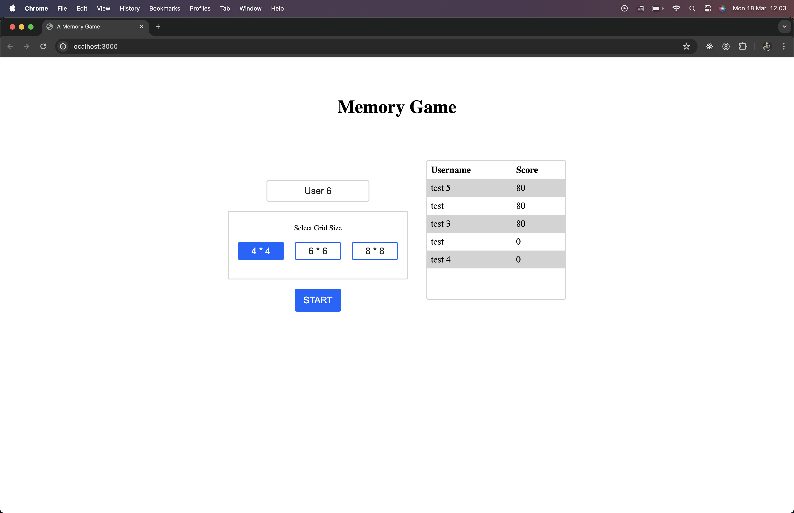
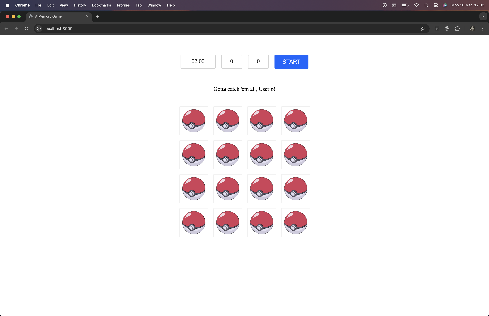
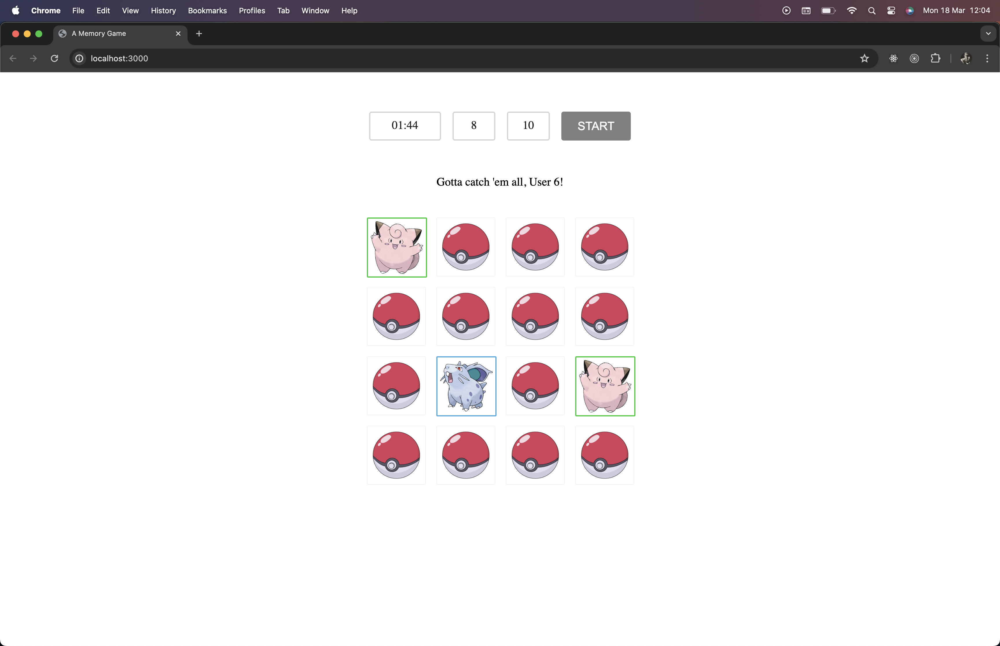
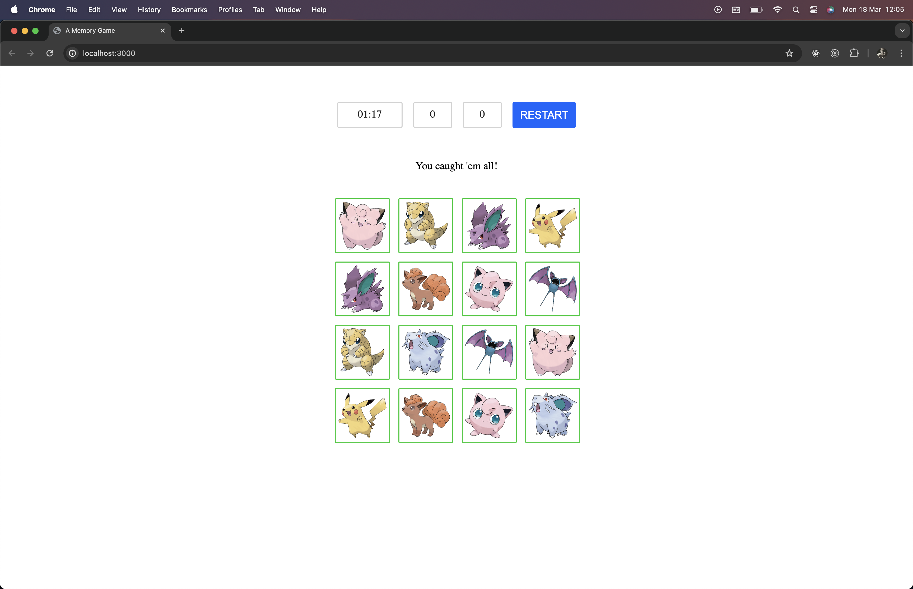

# 🧠 The Memory Game

### How to play?

- Setup the project as usual as mentioned in the README and you will be greeted with a welcome screen.
- You can see option to enter user details and leader board. Leader board details are stored in the backend.
- Entering the username is optional (if nothing is provided then "User" will be the username) but you need to choose grid type.
- After that you can see the game screen. Game only starts when you press the start button otherwise cards are not clickable.
- Once the time is finished or you have won the game your data will be registered.
- You can restart the game again by pressing the button or refresh the screen to see the leader board and go back.

### Challenges

- Developing project without any frontend library was a challenge in itself but it was fun.
- Parts of the app are rendered in separate function then added to the DOM so need to have the specific order to add elements.
- Needed to make extra configuration for testing.
- Images are collected from https://www.pokemon.com/us/pokedex. A bit of a manual work.

### Future Improvements

- If development is continued without frontend library then need to optimize DOM manipulation a bit.
- Add animation on card flip.
- Add routing option in the app.
- Add more testing.

### Game Play Screens

